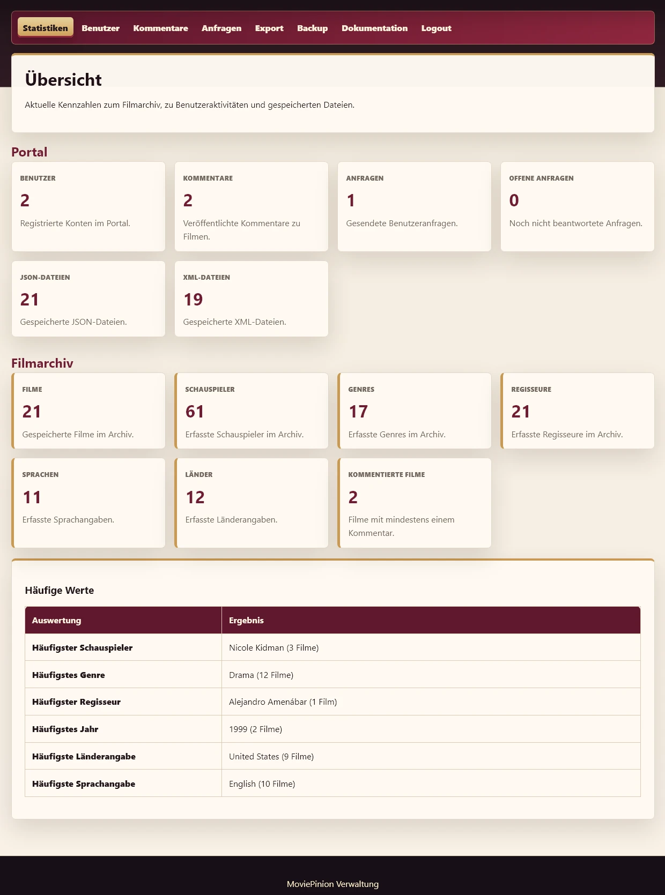
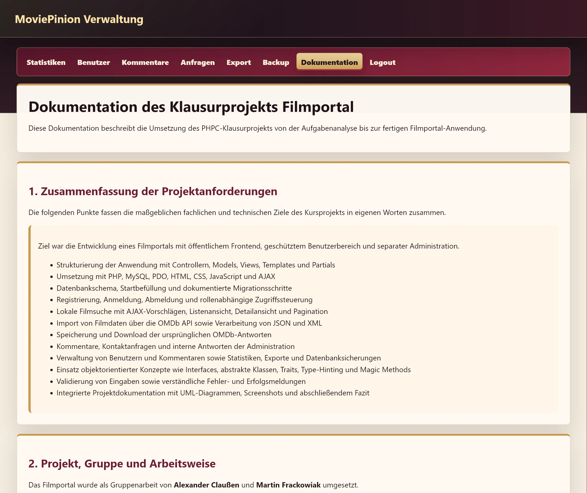

# MoviePinion

MoviePinion ist ein webbasiertes Filmarchiv mit öffentlicher Galerie, Benutzerbereich und separater Administration. Filmdaten werden über die OMDb API abgerufen, als JSON- oder XML-Rohdaten gespeichert und für Suche, Detailansicht, Kommentare, Statistiken und Exporte in eine lokale MySQL-Datenbank übernommen.


> Gemeinsam und gleichwertig entwickelt von **Alexander Claußen** und **Martin Frackowiak** als Gruppenprojekt im Modul PHPC im Rahmen ihrer Qualifizierung zu Fachinformatikern für Anwendungsentwicklung.

| Entwickler | Links |
| --- | --- |
| Alexander Claußen | [GitHub](https://github.com/willywonderwork-code) · [Website](https://www.willywonderworks.cloud/) |
| Martin Frackowiak | [GitHub](https://github.com/blockademarc) |

## Projekt

Das Kursprojekt verbindet eine öffentliche Filmgalerie mit geschützten Benutzerfunktionen und einem eigenständigen Administrationsbereich. Die fachlichen Anforderungen werden in der integrierten Projektdokumentation in eigenen Worten zusammengefasst und durch UML-Diagramme sowie Screenshots ergänzt.

## Funktionen

### Frontend

- Filmgalerie mit Listenansicht, Detailansicht und Pagination
- Lokale Suche nach Titel, Jahr, Regie, Besetzung und Genre
- AJAX-basierte Suchvorschläge
- Registrierung sowie Anmeldung und Abmeldung
- Import von Filmdaten über die OMDb API in JSON oder XML
- Speicherung und Download der ursprünglichen OMDb-Antworten
- Kommentare durch angemeldete Benutzer
- Kontaktanfragen und persönliche Übersicht der Admin-Antworten
- Informationsseiten für About, Kontakt, Impressum und AGB

### Administration

- Separater Backend-Controller mit eigenem Login
- Statistiken zu Benutzern, Filmen und weiteren Anwendungsdaten
- Verwaltung von Benutzern und Kommentaren
- Bearbeitung interner Benutzeranfragen
- Datenexport als JSON, XML und CSV
- Datenbanksicherung mit `mysqldump`
- Integrierte Projektdokumentation mit UML-Diagrammen und Screenshots

## Technische Umsetzung

- PHP 8.1 oder neuer mit objektorientierter Programmierung
- MySQL beziehungsweise MariaDB
- PDO und vorbereitete SQL-Anweisungen
- Einfache MVC-Struktur mit getrennten Models, Views und Controllern
- HTML5 und CSS3
- Vanilla JavaScript und AJAX
- Verarbeitung und Speicherung von JSON und XML
- Passwort-Hashing mit `password_hash()` und Prüfung mit `password_verify()`
- Validierung von Formulareingaben und abgesicherte HTML-Ausgabe
- Interfaces, abstrakte Klassen, Trait, Type-Hinting und Magic Methods
- Keine PHP- oder JavaScript-Frameworks und keine Paketabhängigkeiten

## Externe Datenquelle

Die Filmdaten werden über die [OMDb API](https://www.omdbapi.com/) abgerufen. Für die Nutzung ist ein eigener API-Key erforderlich. Der persönliche Key wird ausschließlich in `includes/config.php` gespeichert und nicht in das Repository übernommen.

MoviePinion ist ein unabhängiges Kursprojekt und steht in keiner Verbindung zu OMDb. Rechte an extern bereitgestellten Filmdaten und Filmplakaten verbleiben bei den jeweiligen Rechteinhabern.

## Voraussetzungen

- Apache-Webserver
- PHP 8.1 oder neuer mit PDO-MySQL und SimpleXML
- MySQL oder MariaDB
- aktiviertes `allow_url_fopen` für HTTPS-Anfragen an die OMDb API
- `mysqldump` für die Backup-Funktion
- eigener OMDb-API-Key

## Installation mit XAMPP unter Windows

1. Repository nach `C:\xampp\htdocs\moviepinion` klonen:

   ```powershell
   cd C:\xampp\htdocs
   git clone https://github.com/blockademarc/moviepinion.git
   cd .\moviepinion
   ```

2. Lokale Konfiguration anlegen:

   ```powershell
   Copy-Item .\includes\config.example.php .\includes\config.php
   notepad .\includes\config.php
   ```

3. In `includes/config.php` den eigenen OMDb-API-Key eintragen. Für die nachstehende Standardinstallation die Datenbankwerte `localhost`, `gruppe2`, `root` und das leere Datenbankpasswort unverändert lassen.

4. Apache und MySQL im XAMPP Control Panel starten.

5. Datenbank und Startdaten für eine neue Installation einrichten:

   > **Nur für die Ersteinrichtung:** Die Datenbank `gruppe2` darf noch nicht existieren. Ist sie bereits vorhanden, bricht der Datenbankimport ab. Das Skript löscht keine bestehende Datenbank. Eine vorhandene Installation direkt über den Browser öffnen.

   ```powershell
   .\setup.bat
   ```

6. Anwendung öffnen:

   ```text
   Frontend: http://localhost/moviepinion/
   Backend:  http://localhost/moviepinion/admin/
   ```

Das Setup legt die Datenbank `gruppe2` an und lädt die vorgesehenen Startfilme über die OMDb API. Der Schemaimport in `setup.bat` verwendet fest den lokalen MySQL-Benutzer `root` ohne Passwort; das SQL-Skript verwendet fest den Datenbanknamen `gruppe2`. Dieser erste Schritt übernimmt keine abweichenden Datenbankangaben aus `includes/config.php`. Die PHP-Anwendung und die anschließende Startbefüllung lesen dagegen diese Konfiguration.

`setup.bat` sucht PHP und MySQL zunächst unter `C:\xampp`. Bei einer anderen Installation müssen `php.exe` und `mysql.exe` über `PATH` erreichbar sein. Die oben angegebenen Browseradressen gelten für die gezeigte Standardinstallation; bei einem eigenen lokalen Hostnamen oder Port sind sie entsprechend anzupassen.

## Lokaler Testzugang

| Bereich | Alias | Passwort |
| --- | --- | --- |
| Administration | `admin` | `admin` |

Weitere Benutzerkonten können über die Registrierung angelegt werden. MoviePinion ist für lokale Lern- und Demonstrationszwecke vorgesehen. Die Anwendung ist nicht für den öffentlichen Produktivbetrieb abgesichert. Das betrifft insbesondere den CSRF-Schutz, die Session-Verwaltung und den Zugriffsschutz für erzeugte Dateien. Die Zugangsdaten `admin` / `admin` sind ausschließlich für die lokale Demonstration bestimmt. Eine Änderung des Admin-Passworts allein reicht für einen sicheren öffentlichen Betrieb nicht aus.

## Dokumentation

Nach der Anmeldung am Backend ist die vollständige Projektdokumentation über den Menüpunkt **Dokumentation** oder direkt unter folgender Adresse erreichbar:

```text
http://localhost/moviepinion/admin/index.php?action=documentation
```

Die Dokumentation enthält:

- eine eigenständig formulierte Zusammenfassung der Projektanforderungen
- Anforderungsanalyse und fachliche Entscheidungen
- Datenbank- und Klassenkonzept
- Erläuterungen zu MVC, OOP, PDO, AJAX sowie JSON- und XML-Verarbeitung
- Beschreibung von Benutzerrollen, Exporten, Backups und Datenflüssen
- UML-Diagramme und Screenshots der wichtigsten Ansichten
- Fazit mit Erfahrungen, Erfolgen und Herausforderungen

<details>
<summary>Weitere Ansichten anzeigen</summary>

### Administration



### Projektdokumentation



</details>

## Projektstruktur

| Verzeichnis | Inhalt |
| --- | --- |
| `admin/` | Backend-Controller, Administrationsansichten, UML-Diagramme und Screenshots |
| `bilder/` | projektbezogene SVG-Grafiken |
| `css/` | Stylesheets für Frontend und Administration |
| `daten/` | lokal erzeugte OMDb-Rohdaten in JSON und XML |
| `docs/` | ergänzende Projektdokumentation und bearbeitbare DIA-Dateien |
| `exports/` | lokal erzeugte Exporte in JSON, XML und CSV |
| `includes/` | Konfiguration, Autoloading, Hilfsfunktionen und OMDb-Client |
| `js/` | AJAX-basierte Suchvorschläge |
| `migrations/` | dokumentierte Datenbankänderungen |
| `models/` | Datenbankzugriffe und fachliche Klassen |
| `sql/` | Datenbankschema und Startbefüllung |
| `views/` | Frontend-Ansichten und Partials |

## Rechte

Das Repository enthält keine Open-Source-Lizenz. Eine Nutzung, Veränderung oder Weitergabe des Quellcodes und der eigenen Projektbestandteile wird dadurch nicht automatisch gestattet.

Externe Inhalte, die zur Laufzeit über die OMDb API abgerufen werden, sind von dieser Rechteerklärung nicht erfasst.

## Datenquelle und Rechte

MoviePinion kann externe Filmdaten über die
[OMDb API](https://www.omdbapi.com/) von Brian Fritz abrufen. Laut Anbieter stehen die von OMDb bereitgestellten Inhalte unter [CC BY-NC 4.0](https://creativecommons.org/licenses/by-nc/4.0/).

API-Schlüssel, von OMDb abgerufene JSON-/XML-Dateien und lokale Posterdateien sind nicht Bestandteil dieses Repositories. Die Galerie-Screenshots zeigen fiktive Filme mit eigens für dieses Projekt erstellten Postern. Diese lokalen Beispieldaten werden nicht mitgeliefert. Die Startbefüllung lädt stattdessen die in `sql/filme_befuellen.php` aufgeführten Filme über die OMDb API.
